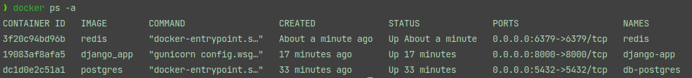

1. Клонировать проект

```bash
git clone https://github.com/arinazaikina/skypro_course_8_docker.git
```

2. Перейти в корневую папку проекта

```bash
cd skypro_course_8_docker/django_project
```

# Задание 2

Создать контейнер с подходящей версией Python.
Запустить django-проект в контейнере.
Открыть стартовую страницу проекта на хостовой машине.

1. В корневой папке проекта есть Dockerfile, который содержит
   инструкции для создания образа.
   Создать образ:

```bash
docker build -t django_app .
```

Проверить, что образ создан, можно с помощью команды:

```bash
docker images
```

В списке образов должен быть образ django_app.

2. Запустить контейнер с приложением:

```bash
docker run --name django-app -p 8000:8000 django_app
```

3. Открыть стартовую страницу на хостовой машине:
   http://127.0.0.1:8000

# Задание 3

- Создать контейнер, в котором будет развернута БД PostgreSQL.
- Создать локально папку, в которую будут размещаться данные базы.

1. Создать локальную папку для хранения данных БД.

```bash
mkdir ~/Documents/python_developer/skypro/postgres-data
```

2. Убедиться, что порт 5432 свободен.
   С помощью команды можно проверить какие есть процессы на порту 5432:

```bash
netstat -tuln | grep 5432
```

На моей хостовой машине порт был занят локально установленной версией PostgreSQL

```
tcp        0      0 127.0.0.1:5432          0.0.0.0:*               LISTEN
```

Остановка локальной версии PostgreSQL

```bash
sudo service postgresql stop
```

3. Запуск контейнера с PostgreSQL с помощью официального образа.

```bash
docker run --name db-postgres -e POSTGRES_PASSWORD=qwerty123 -v ~/Documents/python_developer/skypro/postgres-data:/var/lib/postgresql/data -p 5432:5432 -d postgres
```

4. Проверка работы PostgreSQL

- Запустить оболочку bash, чтобы получить доступ к командной строке контейнера

```bash
docker exec -it db-postgres /bin/bash
```

- Запустить клиентскую утилиту командной строки PostgreSQL

```bash
psql -U postgres
```

- Создать БД

```bash
create database django_project;
```

- Просмотерть список БД

```bash
\l
```

- Выход

```bash
\q
```

- Выход из контейнера

```bash
exit
```

# *Дополнительное задание

Развернуть в Docker Redis для работы с очередями и подключите его к текущему проекту.

1. Остановила локальный redis

```bash
sudo systemctl stop redis
```

2. Запустить контейнер с redis

```bash
docker run --name redis -d -p 6379:6379 redis
```

Запущенные контейнеры


